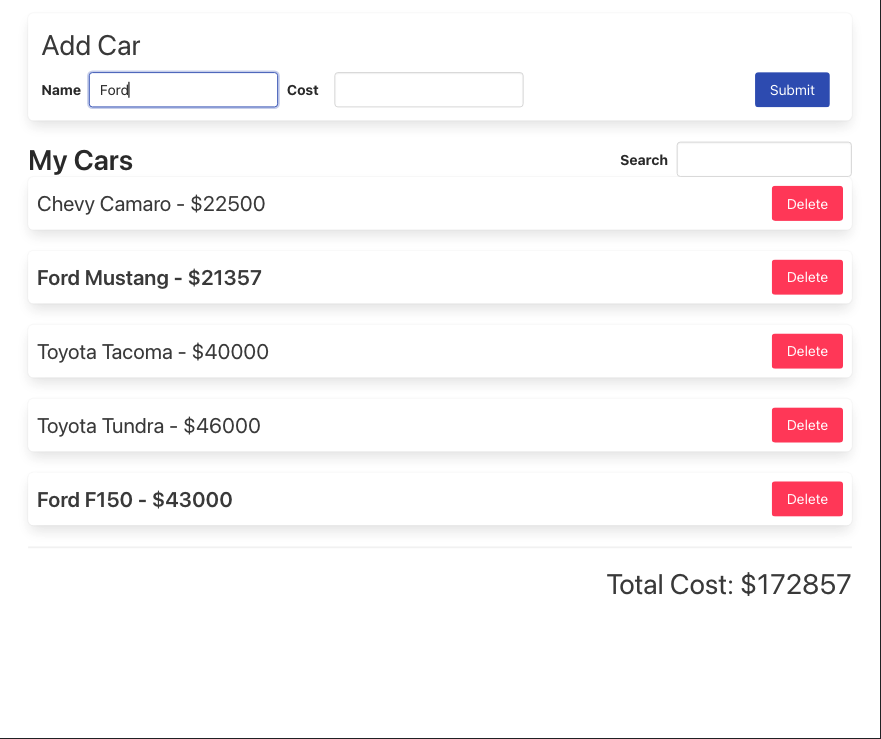

# Movie-Song-Playlist-Redux 

  ## Description

  This is a simple app built with React and using Redux to manage state.  The app allows users to add cars and the car's cost, search for cars that have been added, and delete cars.  The total cost of all cars is displayed and updated as user adds/deletes cars, or if the list is filtered by search term.
  
  Screenshot of app:

  

  
  ## Table of Contents
  
  - [Installation](#installation)
  - [Usage](#usage)
  - [License](#license)
  - [Contributing](#contributing)
  - [Tests](#tests)
  - [Questions](#questions)
  
  ## Installation
  
  npm install
  
  ## Usage
  
  npm start

  ## License
This application is covered under the MIT License.
 For more information: https://opensource.org/licenses/MIT
  
  ## Contributing
  N/A
  
  ## Tests
  N/A

  ## Questions
  Contact Info 
  GitHub user name: BillStephens2022 
  Link to GitHub profile: https://github.com/BillStephens2022 
  Email: stephensbill17@gmail.com

